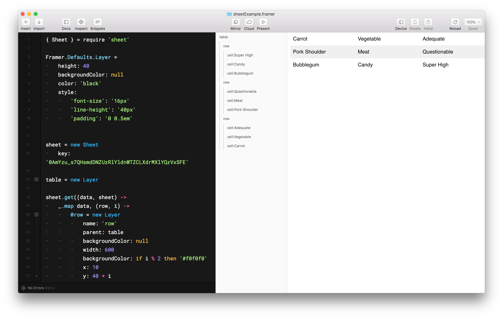
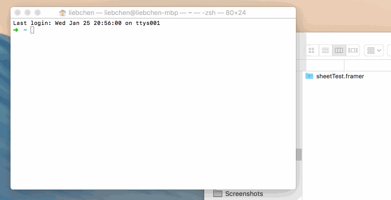

# Framer-Sheet

Import information from Google Sheets into Framer.



## Add it to your Framer Studio project

 * Create and save a new Framer project (if you don't have one started already)
 * [Download](https://github.com/andrewliebchen/framer-sheet/archive/master.zip) or clone this repository
 * Copy `sheet.coffee` and `npm.coffee` to your `/modules` directory
 * Open your Terminal, drag your framer project into the Terminal window and press enter. The path in the Terminal will update to your Framer project
 * Type `npm install tabletop` to get the dependency from NPM



 * Import the module into your project by adding `{ Sheet } = require 'sheet'` to the top of your project's code

## How to use it

Getting started is pretty easy. Follow the instructions above to install the module. You'll also need a [Google Sheets](http://drive.google.com/) document to import. Here's how to set up your sheet:

Go up to the `File` menu and pick `Publish to the web`. Fiddle with the options, then click `Start` publishing. A URL will appear, something like `https://docs.google.com/spreadsheets/d/1sbyMINQHPsJctjAtMW0lCfLrcpMqoGMOJj6AN-sNQrc/pubhtml` (of course, it might look a little different).

In the example URL above, you're interested in the key, which is between the `/d/` and `/pubhtml`, so `1sbyMINQHPsJctjAtMW0lCfLrcpMqoGMOJj6AN-sNQrc`. Copy this value.

In your Framer project, instantiate a new instance in your project:

```coffeescript
{ Sheet } = require 'sheet'

sheet = new Sheet
	key: '1sbyMINQHPsJctjAtMW0lCfLrcpMqoGMOJj6AN-sNQrc'
```

Now, to actually GET the data from your sheet, call the `get` method:

```coffeescript
sheet.get((data, sheet) ->
  print data
)
```

...which should print an array of objects (a collection) like...

```
» [{Name:"Carrot", Category:"Vegetable", Healthiness:"Adequate"},
  {Name:"Pork Shoulder", Category:"Meat", Healthiness:"Questionable"},
  {Name:"Bubblegum", Category:"Candy", Healthiness:"Super High"}]
```

Pretty cool, huh? You'll see in the example project, I've used Lodash's `map` to split the collection into rows which and cells for a table.

```coffeescript
sheet.get((data, sheet) ->
	_.map data, (row, i) ->
		@row = new Layer
			name: 'row'
			parent: table
#     ...

    @name = new Layer
			html: row.Name
			name: "cell:#{row.Name}"
			parent: @row
#     ...
```

This is only the beginning...what else can you think to do?

## More information

This module makes use of [Tabletop.js](https://github.com/jsoma/tabletop) for the heavy lifting. For more information, check out their documentation, including a section on how to format your Google Sheet.
